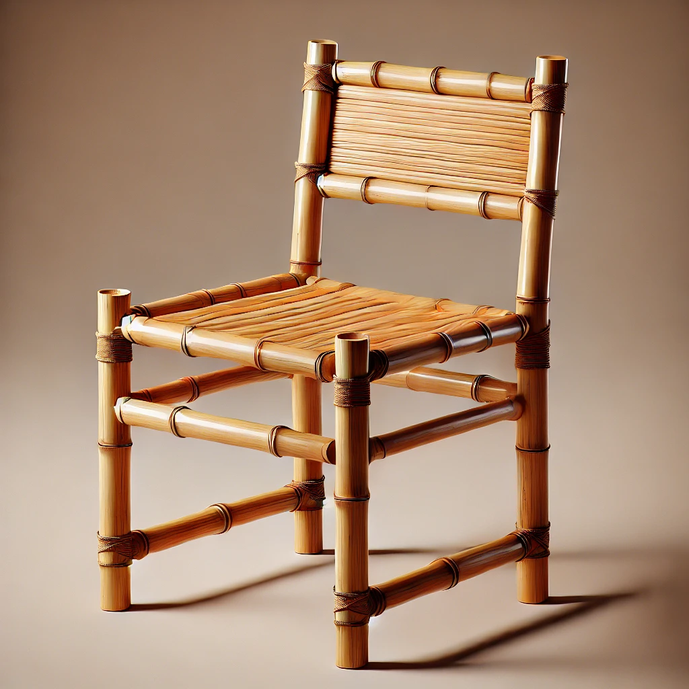

[Link to chatGPT](https://chatgpt.com/c/66df033f-b848-8006-adb7-68fa47a4d962)


Creating a bamboo student chair can be a sustainable and eco-friendly alternative for schools. Here's a general guide to help you design and build one:

Materials Needed:
1. Bamboo poles (Thick and sturdy for the frame, thinner for support)
2. Bamboo slats (For seating and backrest)
3. Wood glue or epoxy resin (For joining bamboo parts)
4. Saw or bamboo cutter
5. Drill (For screws and bolts)
6. Screws and bolts (If you want added strength)
7. Sandpaper (For smoothening rough edges)
8. Rope or twine (For lashing joints together, optional)
9. Varnish or sealant (To protect the bamboo)

##### Step-by-Step Instructions:

**1. Design the Chair**

- Create a simple design with a seat height of about 17-18 inches and a seat depth of 15-18 inches.
- The chair legs can be around 1.5–2 inches in diameter, while the backrest slats and seat can be made from thinner bamboo.

**2. Cut Bamboo to Size**

- Legs: Cut four sturdy bamboo poles for the legs. These should be about 17–18 inches for a standard student chair.
- Seat Frame: Cut bamboo poles to form a rectangular seat frame, around 15 x 18 inches.
- Backrest Frame: Cut two vertical bamboo poles around 12–16 inches high for the backrest and a horizontal pole for the top part.
- Seat Slats: Cut several bamboo slats, roughly 1-2 inches wide and long enough to fit across the seat frame.

**3. Assemble the Frame**

- Seat Frame: Attach the four legs to the seat frame by drilling small holes and using screws or strong adhesive. Alternatively, you can lash the joints tightly with twine for added support.
- Backrest: Attach the two vertical poles to the back part of the seat frame. Then, attach the horizontal slat for the top of the backrest.

**4. Prepare the Seat and Backrest**

- Seat: Place the bamboo slats across the seat frame, evenly spaced. Secure them using wood glue, or drill small holes and screw them into the seat frame.
- Backrest: Similarly, attach bamboo slats vertically or horizontally on the backrest frame.

**5. Reinforce Joints**

- Use additional wood glue or rope lashing to reinforce each joint. Ensure the chair is stable and can support weight.

**6. Sand the Bamboo**

- Use sandpaper to smooth out any rough edges or splinters on the bamboo surfaces, especially the seat and backrest areas.

**7. Varnish or Seal the Bamboo**

- Apply a protective varnish or sealant to protect the bamboo from moisture and wear. This will also give the chair a polished finish.

Optional Additions:

- Cushioning: You can add a thin foam cushion or cloth to make the chair more comfortable.
- Adjustable Height: If desired, you could design the legs to be adjustable using bolts and pre-drilled holes.
- This simple bamboo student chair can be durable, environmentally friendly, and cost-effective for schools.


You said:
I would like to start a business project to produce and sell Bamboo Student chairs. Can you give me a business plane that includes the steps you gave me above. The business plan should include financials.


Here's a basic business plan for producing and selling Bamboo Student Chairs, based on the steps provided for manufacturing. This plan includes an executive summary, market analysis, financial plan, and implementation strategy.

1. Executive Summary

**Business Name:** EcoSmart Bamboo Chairs

**Business Type:** Manufacturing and Sales

**Product:** Sustainable, eco-friendly bamboo student chairs for schools and educational institutions.

**Mission:** To provide eco-friendly, durable, and affordable seating solutions to schools, contributing to sustainability efforts.

**Target Market:** Schools, educational institutions, and eco-conscious consumers.

2. Business Objectives
- Produce high-quality bamboo student chairs that are sustainable and eco-friendly.
- Capture 5% of the local school furniture market within the first year.
- Achieve profitability within 12-18 months of operation.
- Scale production to serve national and potentially international markets by year three.
3. Market Analysis
- Target Market: Educational institutions (public and private schools, universities, libraries).
- Market Trends: Growing awareness of environmental issues and sustainability. Increasing demand for eco-friendly alternatives to traditional furniture materials like plastic and metal.
- Competitive Advantage: Bamboo is renewable, lightweight, and durable. Chairs made from bamboo can be more cost-effective than metal or wood alternatives while contributing to eco-friendly branding.
4. Product Description
Bamboo Student Chairs: Ergonomic, lightweight, and durable chairs made from sustainably sourced bamboo.
Unique Selling Proposition: Eco-friendly, cost-effective, and customizable for schools or institutions (branding options, cushion materials, etc.).
5. Marketing Strategy
Pricing: Competitive pricing, starting at $30 per chair, with bulk discounts for schools and institutions.
Promotion:
Leverage social media marketing to promote eco-friendly values.
Partner with schools and educational institutions to showcase your chairs at events and open days.
Attend trade shows and exhibitions related to education and sustainability.
Distribution: Direct sales through a dedicated website, partnerships with school suppliers, and local retailers.
6. Operations Plan
Production Process:

Source bamboo from local suppliers or sustainable bamboo farms.
Manufacture the chairs in-house using skilled laborers and standard tools (as described in the manufacturing steps).
Implement quality control checks for each batch of chairs.
Pack and ship orders to customers (schools, retailers, or direct buyers).
Location: Set up a workshop for chair production. Consider renting a medium-sized facility in an affordable area.

Labor: Hire skilled carpenters and laborers familiar with bamboo work. An initial team of 5-7 people may be required to begin production.

7. Financial Plan
Startup Costs:
```
Item	Cost
Workshop Rent (6 months)	$5,000
Bamboo Raw Material (initial batch)	$2,500
Equipment and Tools	$3,000
Labor (initial 3 months)	$6,000
Packaging and Shipping Materials	$1,500
Marketing Budget	$2,000
Website Development	$1,500
Miscellaneous	$1,000
Total Startup Costs	$22,500
```
**Revenue Projections:**

- Selling Price per Chair: $30
- Expected Monthly Sales (initial 6 months): 300 chairs
- Monthly Revenue: $30 x 300 = $9,000

Costs per Month:

- Labor: $2,000
- Bamboo Material: $1,000
- Rent: $1,000
- Marketing & Miscellaneous: $500
- Total Monthly Costs: $4,500

**Profit (First 6 months):**

- Revenue: $9,000
- Costs: $4,500
- Monthly Profit: $4,500

**Break-even Point:**

- With total startup costs at $22,500 and monthly profit at $4,500, the business should break even within 5 months.

**8. Risk Analysis**

- Supply Chain Disruption: Delays in bamboo supply could impact production. Mitigate by maintaining strong relationships with multiple suppliers.
- Competition: Competitors may enter the market with similar products. Stay ahead by focusing on quality, sustainability, and affordability.
- Economic Factors: School budgets may fluctuate. Offer flexible payment terms or discounted bulk orders.

**9. Implementation Timeline**

- Month 1-2: Secure funding, set up workshop, hire labor, and establish supply chains.
- Month 3: Begin production and build an initial inventory.
- Month 4: Launch marketing campaign, reach out to schools, and attend trade shows.
- Month 5: Start receiving and fulfilling orders.
- Month 6: Evaluate initial performance, adjust pricing or production strategy if needed.

This business plan provides a structured approach for producing and selling bamboo student chairs. With the growing demand for sustainable products, the market for bamboo furniture is promising, and the financials suggest a reasonable path to profitability.




CONTACT:

Contact Gladstone Rose of Quality Solutions Limited ( WhatsApp 876-783-2423) to shedule a zoom meeting to discuss your bamboo project

© 2024 Gladstone Rose-QSL Limited. All rights reserved until given direct permission to use this document after a schedued zoom meeting.

